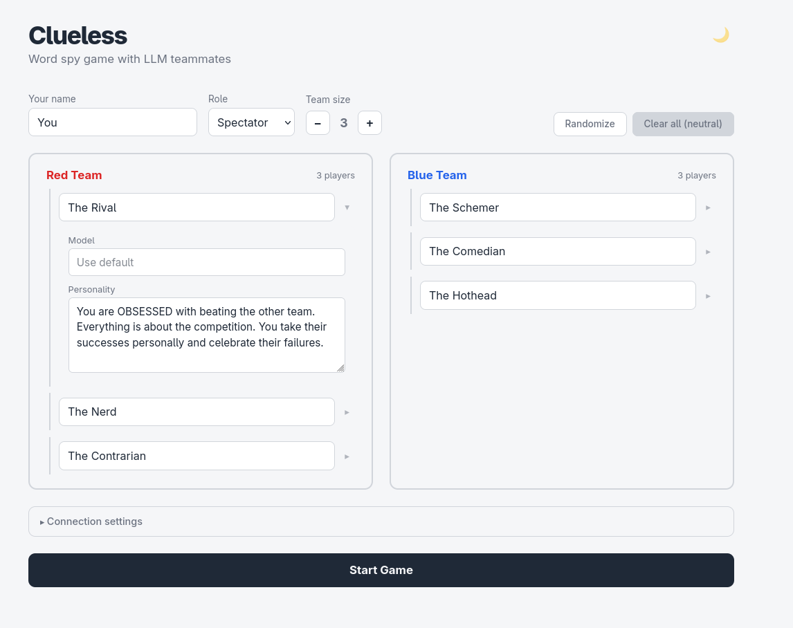
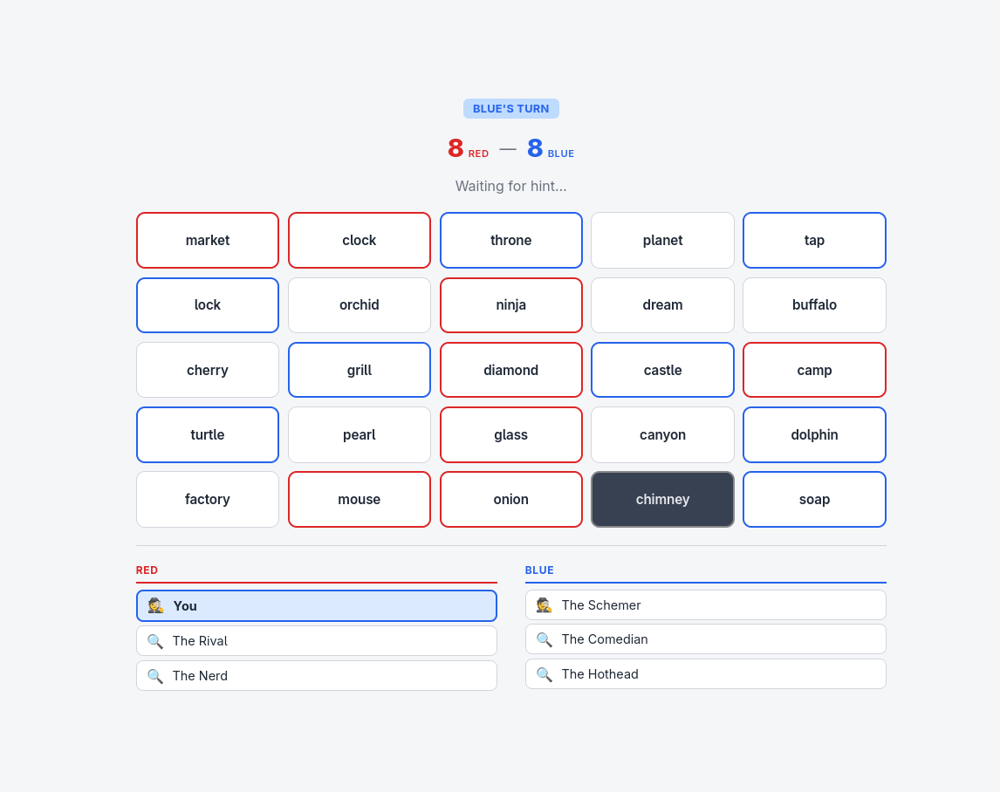
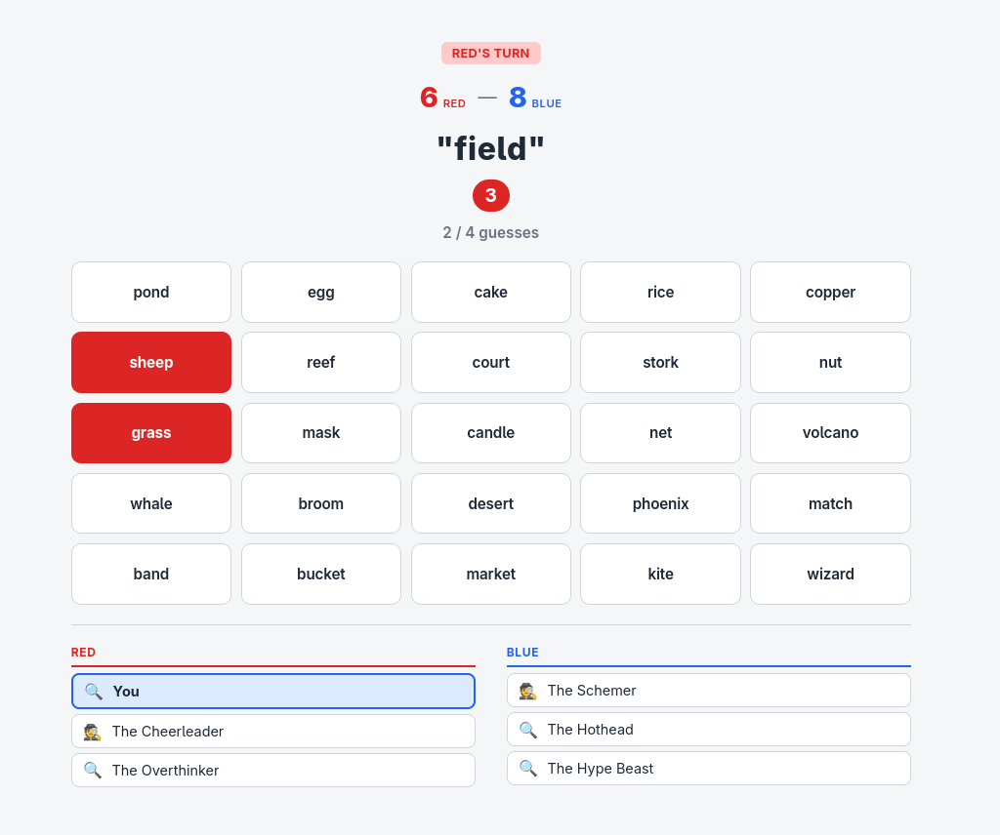
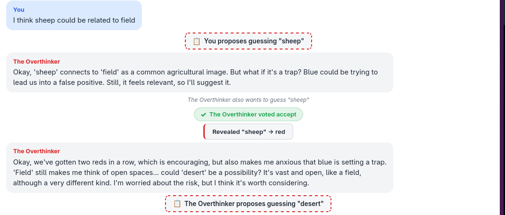

# Clueless

A word spy game inspired by Codenames where LLM-powered players debate and compete on teams.

- **Play or spectate**: Take the role of spymaster or operative alongside AI teammates, or watch a fully autonomous AI vs AI match
- **Distinct AI personalities**: 20 character types from The Hothead to The Overthinker that genuinely shape how each player reasons and argues
- **TTS Output**: Optional text-to-speech with Kokoro for immersive voiced dialogue
- **Real deliberation**: AI players don't just guess; they debate interpretations, disagree, change their minds, and build on each other's ideas
- **Proposal and voting system**: Guesses require team consensus through structured proposals and votes
- **Any LLM backend**: Works with any OpenAI-compatible endpoint; mix different models across teams or individual players

## Setup

1. Clone the repo.

2. Create `.env`:

```env
LLM_BASE_URL=your-llm-base-url
LLM_MODEL=your-model-name
LLM_API_KEY=your-api-key
```

3. Run:

```bash
npm install
npm run dev
```

4. Visit `http://localhost:5173` to play or spectate!

---

## How It Works

Two teams compete to find their words on a 25-word board. **Spymasters** give one-word hints, **operatives** discuss and vote on guesses. Hit your words to continue, hit opponent's or neutral to end turn, hit assassin to lose.


*Choose role, join team, configure AI personalities*

---

## Game Modes

### 🕵️ Spymaster
You give hints, AI guesses.


*Colored borders show card ownership*

### 🎯 Operative
AI gives hints, you guess with AI teammates.



**Make proposals:**

Proposal:


Chat:



**Vote on proposals:**

Vote:


Chat:


### 👁️ Spectator

Watch AI vs AI with full visibility.

Click [here](https://www.youtube.com/watch?v=dO0b7Gf278s) to see an example match played by Gemini-3-Flash with TTS enabled.